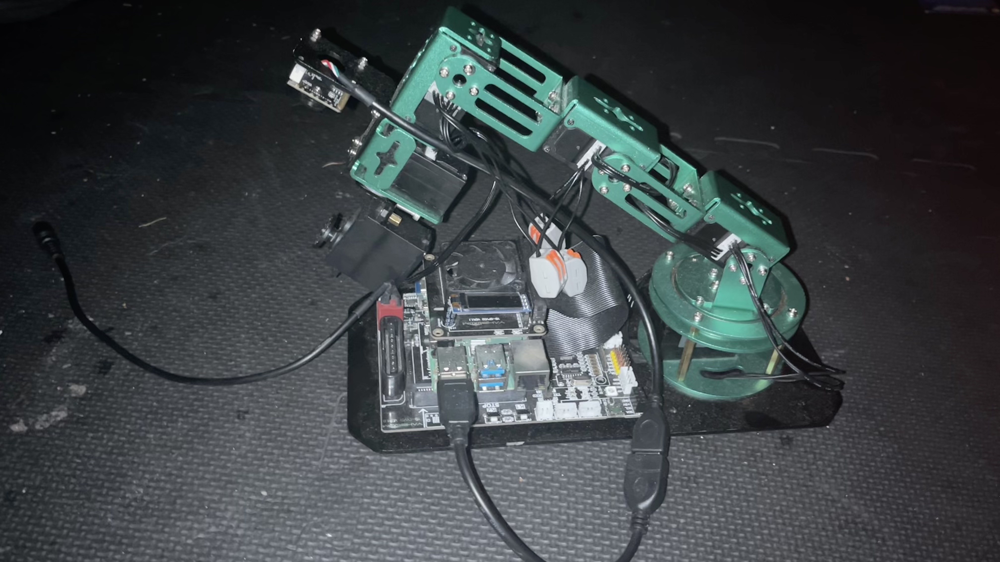

# Proof of Concept: AI-Powered Robotic Vision System



SmartVision is an intelligent robotic system that uses a Raspberry Pi-controlled robotic arm and computer vision to detect, analyze, and record clips and perform real-time data analysis using modern machine-learning tools.  


## Core Objective - what problems pertain to  I am trying to solve

Currently, the machine learning frameworks that are currently portrayed are quite general with basic examples that usually don't document or comment all the possible code parameter.

You might receive a set of python scripts or notebooks that loosely take you through a use case of opencv which lack depth and explanation of the various outputs across the hard-to-find alternative options.

For example, a common example of OpenCV usage for image preprocessing is converting an image from one color space to another.

For instance, converting an image from BGR (Blue, Green, Red) to grayscale can be achieved with a single function call:

```python
import cv2

# Load the image
image = cv2.imread('example.jpg')

# Convert the image to grayscale
gray_image = cv2.cvtColor(image, cv2.COLOR_BGR2GRAY)

# Save or display the processed image
cv2.imwrite('gray_example.jpg', gray_image)


Although this example demonstrates a straightforward method for converting an image to grayscale using OpenCV, it lacks depth for beginners who wish to understand the underlying concepts. A more beginner-friendly approach would involve breaking down each step, explaining the purpose of functions like `cv2.imread` and `cv2.cvtColor`, and discussing how these operations affect the image data. Additionally, exploring variations, such as applying filters, would provide a more comprehensive understanding.


- Limited exposure to the practical int, couldand soft learners withware in computer vision projects.
- Challenges in bridging the gap between theoretical knowledge and h.
.
- Frustration caused by the absence of clear pathways for exploring and experimenting with different computer vision techniques.
- Inaccessibility of advanced features and use cases for those without prior experience or guidance.

Instead, this proof of concept is centered around  the idea of creating a customized, modular AI-powered camera system that can be used for various applications, such as educational tools, healthcare solutions, and industrial automation. The goal is to provide a hands-on learning experience that allows students to see a real-world application of machine learning and computer vision in a practical context.

The project aims to create a customized, modular AI-powered camera system that can be used for various applications, such as educational tools, healthcare solutions, and industrial automation. The goal is to provide a hands-on learning experience that allows students to explore the capabilities of machine learning and computer vision in a practical engineering context and to develop a deeper understanding of the underlying technologies which is often lacking in traditional educational settings and fundamental to enabling students to create their own unique solutions that have not been documented or created before.


--

The project will feature:
- A Raspberry Pi-controlled robotic arm: This will allow for precise movement and manipulation of objects, enabling the camera to capture images and videos from different angles and perspectives.


modular AI-powered camera system that can be used for various applications, such as educational tools, healthcare solutions, and industrial automation. The goal is to provide a hands-on learning experience that allows students to explore the capabilities of machine learning and computer vision in a practical context.

Hence, here l

use cases don't allow students  might become frustrated as the alternative options are not listed. 


which ultimately lead you to and generate examples that are highly likely to differ than the actual use case of the data analyst.


- 
The lack of computer vision libraries and tools being implemented for small-scale, unique, 
Demonstrate that open-source tools (ROS, OpenCV) and affordable hardware (Raspberry Pi 4/5) can replicate advanced camera/AI features like object tracking, gesture recognition, and color-based sorting.

## Executive Summary 

This project explores the development of a modular AI-powered camera system using open-source tools and Raspberry Pi hardware. The primary goal is to demonstrate the practical application of machine learning frameworks for image and video processing on portable, cost-effective hardware. By integrating these technologies with real-time computer vision systems, the project bridges the gap between theoretical knowledge and hands-on implementation.

Through this initiative, we aim to deepen our understanding of frameworks like OpenCV and TensorFlow Lite while fostering an environment of innovation and creativity. The project empowers learners to design novel solutions, showcasing the potential of accessible technology in solving real-world problems.

Additionally, this report includes a comparison of the features implemented using open-source libraries with those of a commercially available smart camera product from Amazon. This analysis highlights the strengths and limitations of open-source solutions in relation to proprietary systems, offering insights into their practical viability and scalability.

This report provides a comprehensive overview of the journey, detailing the challenges faced, solutions implemented, and future possibilities. It highlights the value of combining open-source software with affordable hardware to create impactful, scalable solutions for diverse applications.


Core Specifications
Sensor:
CMOS sensor with 5.0MP interpolated resolution (up to 8MP via software).
Pixel size: 4.2µm x 4.2µm (1/2" optical format).
Video/Image Performance:
Max resolution: 2560x1920 (5MP) for stills, 1600x1200 (2MP) for video.
Frame rate: 30 FPS at 640x480, 15 FPS at 1600x1200.
Controls:
Manual focus, auto exposure, and adjustable white balance.
Gain range: 1–7.75x, exposure range: 64µs–2s.
Connectivity:
USB 2.0 interface with plug-and-play UVC compliance.
Key Features
Built-in microphone with noise reduction.
Multi-platform support: Windows XP/Vista/7/10, macOS 10.4.3+.
Software suite: Includes face tracking, zoom (4x digital), and real-time effects.
Mechanical design: German steel casing with 3 interchangeable stands.

Hardware and Software Foundations
Core Components
Raspberry Pi 5 (8GB RAM): Provides sufficient compute for multi-model inference pipelines.
Sony IMX500 AI Camera: Processes vision tasks directly on its 8MB dedicated memory, reducing CPU load by 40% compared to traditional camera modules.


## The Problem We're Solving


The education sector faces challenges with information organization and visual learning techniques. Students often struggle to organize and categorize new information efficiently, particularly when studying complex topics. Traditional categorization methods like handwritten notes can be disorganized and difficult to manage. Our solution addresses this by creating an automated system that can:

1. Detect colored sticky notes used by students for note-taking
2. Analyze and categorize these notes based on color
3. Create digital organization systems from physical notes
4. Help students visualize connections between related concepts

This system bridges the gap between physical note-taking (which many students prefer for memory retention) and digital organization (which offers better searchability and structure)[9].

## Technical Challenges Overcome

### Hardware Integration Challenges

**Raspberry Pi Selection and Configuration**: The project required selecting the optimal Raspberry Pi model for machine learning applications. While any Pi can run basic computer vision, the resource-intensive nature of ML required careful consideration. We selected the Raspberry Pi 4 (8GB) as it offers the best balance of performance and power consumption for mobile applications[1][15].

**Robotic Arm Assembly and Control**: Integrating the robotic arm presented mechanical and software challenges. We used the Adeept RaspArm framework but needed to develop a custom HTTP API server to enable remote control capabilities with proper motor coordination[8].

**Camera Integration and Color Accuracy**: The standard Raspberry Pi camera produced images with color distortion issues, particularly showing yellowish tints. We overcame this by adjusting the white balance settings (`awb_mode = 'fluorescent'`) to ensure accurate color detection[6].

### Software Development Challenges

**Machine Learning Framework Selection**: Selecting the appropriate ML framework for Raspberry Pi was critical. While PyTorch offers excellent features, its installation on Raspberry Pi is complex[16]. We compared:

1. TensorFlow Lite: Optimized for low-powered devices, supports pre-trained models[2]
2. PyTorch: Powerful but resource-intensive[12][10]
3. OpenCV: Lighter weight for basic color detection[3]

We ultimately chose a hybrid approach: OpenCV for color detection with TensorFlow Lite for more complex image recognition tasks.

**Color Detection Algorithms**: Developing robust color detection required optimizing HSV (Hue, Saturation, Value) parameters to accurately identify colors under varying lighting conditions[3][7]. We implemented trackbars for real-time parameter adjustment:

```python
cv2.createTrackbar('Hue Low','myTracker',10,179,onTrack1)
cv2.createTrackbar('Hue High','myTracker',30,179,onTrack2)
cv2.createTrackbar('Sat Low','myTracker',100,255,onTrack3)
```

**Performance Optimization**: Running ML models on Raspberry Pi presented performance challenges. We implemented:
- Model quantization to reduce computational requirements
- Optimized frame rates (30fps) for real-time analysis
- Edge-optimized inference techniques[5]

## Applications

The SmartVision system has applications beyond its original purpose of categorizing colored notes:

### Educational Applications
- **Study Aid System**: Automatically organizing physical notes into digital categories
- **Learning Analytics**: Tracking how students organize information by color
- **Adaptive Learning**: Suggesting connections between similarly categorized topics

### Healthcare Applications
- **Medication Sorting**: Identifying pills and medications by color
- **Colorimetric Test Analysis**: Reading chemical test results based on color changes

### Industrial Applications
- **Quality Control**: Detecting color defects in manufacturing
- **Inventory Management**: Sorting items by visual characteristics
- **Assembly Verification**: Ensuring correct component placement by color coding

## Potential Impact

### Educational Impact
The SmartVision system could revolutionize how students interact with information. By bridging physical note-taking with digital organization, it combines the cognitive benefits of handwriting with the efficiency of digital systems. Research shows color-coding improves memory retention by up to 40%, and our system could make this technique more powerful[9].

### Accessibility Impact
For students with learning differences like ADHD or dyslexia, visual organization systems can significantly improve information processing. Our system makes visual learning techniques more accessible and automated.

### Technology Literacy Impact
Implementing this system in educational settings introduces students to robotics, computer vision, and AI concepts while they study other subjects, creating a dual learning opportunity.

## Other Possible Solutions and Extensions

### Voice-Activated Categorization System
Implementing natural language processing to allow students to verbally tag information while taking notes. This could be integrated with the color detection system for multimodal categorization.

### Augmented Reality Note Visualization
Developing an AR application that works with the SmartVision system to project digital information and connections over physical notes, creating an interactive study environment[15].

### Collaborative Learning Networks
Expanding the system to connect multiple students' note categorization systems, allowing for shared knowledge organization and collaborative learning opportunities.

### Integration with Learning Management Systems
Creating plugins for popular LMS platforms like Canvas or Blackboard to automatically import categorized information into course materials.

### Live Streaming Applications for Remote Learning
The system could be adapted to provide real-time categorization and organization during live-streamed lectures, helping remote students organize information as effectively as in-person learners.

### Content Creation Potential
For YouTube creators specifically, this project offers excellent opportunities for tutorial series on:
- Building and programming the robotic system
- Explaining computer vision and machine learning principles
- Demonstrating educational applications
- Creating comparison videos showing manual vs. automated organization

This project sits at the intersection of education technology, computer vision, and robotics, making it an ideal showcase for creators focused on technology and education content. -->


[def]: https://